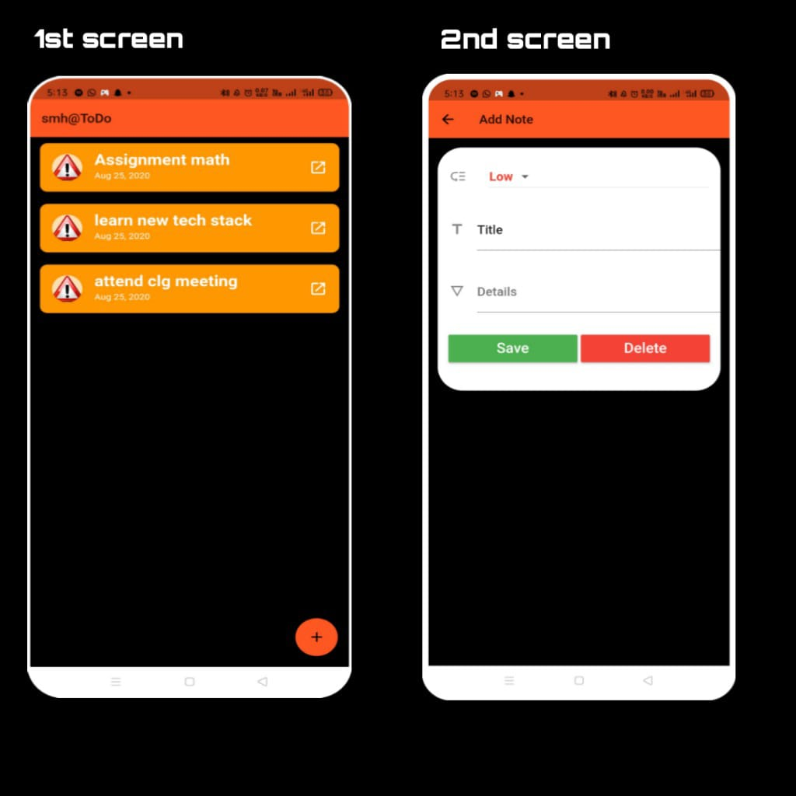

# myTODO
A simple fully-fledged TODO mobile application. 
Built using Flutter and SQLite.

### Screenshots

### steps
1. run `flutter create <application name>` on ur command line
2. download the repository and copy lib, assets, android files accordingly.
3. connect a device with USB debugging mode ON or run a mobile simulator.
4. check `flutter doctor` for proper working
5. run `flutter run`
